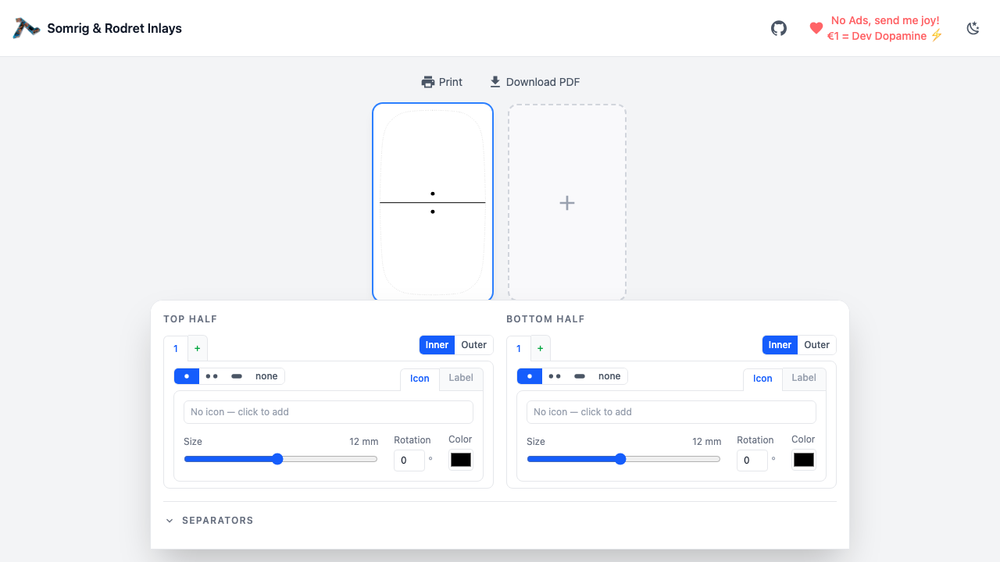
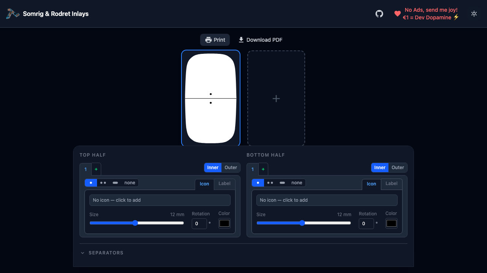

# Somrig & Rodret Inlay Sheet Builder

A browser-based tool for designing and printing custom inlay sheets for **Somrig** and **Rodret** smart home buttons (IKEA DIRIGERA ecosystem). No account, no install, no data sent anywhere — works entirely in your browser.

**Live app:** [somrig.netlify.app](https://somrig.netlify.app) *(or your Netlify URL)*

---

## What it does

Each physical button has a **top half** and a **bottom half**, and each half can have **1–3 action zones**. This tool lets you:

- Pick icons from the full Material Design Icons library
- Add text labels (above or below the icon)
- Set action type indicators (single press, double press, hold, or none)
- Configure indicator position (inner / outer)
- Customize separator line style (solid, dashed, dotted) and thickness
- Preview the inlay at print-accurate scale
- Print directly or save as PDF — what you see is what you get

---

## Screenshots

### Light mode


### Dark mode


---

## Tech stack

| Layer | Choice |
|-------|--------|
| Build | Vite 8 (Rolldown-based) |
| Framework | Vue 3.5 (Composition API, `<script setup>`) |
| Styling | Tailwind CSS v4 |
| Icons | `@mdi/js` (Material Design Icons, path-based SVG) |
| Language | TypeScript 5.9 (strict) |
| Deploy | Netlify |

---

## Running locally

```bash
npm install
npm run dev        # dev server at http://localhost:5173
npm run build      # type-check + production build → dist/
npm run preview    # preview production build
```

### Tests

```bash
npm run test:e2e      # Playwright e2e tests (starts dev server automatically)
npm run test:e2e:ui   # Playwright UI mode
npm run screenshot    # Capture screenshots to tests/e2e/screenshots/
```

---

## Contributing

Issues and PRs are welcome. If you have a feature request or found a bug, open an issue — this project was born from community feedback and that's how it stays useful.

Linear project: `LQM-*` issue prefix (internal tracking).

---

## License

MIT — see [LICENSE](LICENSE).
